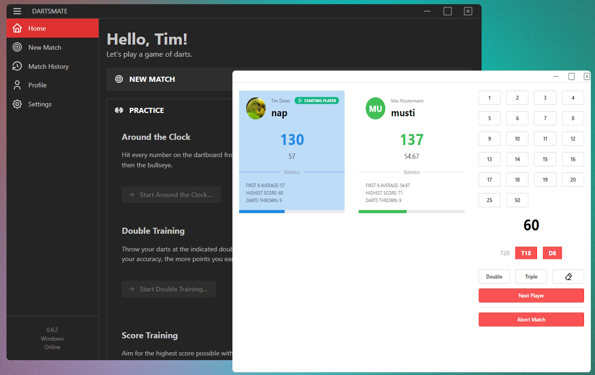

# :dart: DartsMate

**Analyze, compare and track your dart games with DartsMate - Build with [nextron](https://github.com/saltyshiomix/nextron), [Next.js](https://github.com/vercel/next.js) & [Mantine](https://github.com/mantinedev/mantine)**

:warning: The project is currently still a work in progress. Many functions and ideas are not implemented yet!

---

### Project Status

### Repository Status

---

## Features

- **Create & Manage Profiles:** Easily create and manage player profiles for your matches.
- **Create A Match:** Set up a game with and customize various game settings.
- **Analyze Your Latest Matches:** Gain valuable insights into your performance and track your progress.
- **Multi-Language Support:** DartsMate supports multiple languages, allowing users to enjoy the app in their preferred language.

## Scripts

| Script                  | Description                                                                                  |
| ----------------------- | -------------------------------------------------------------------------------------------- |
| `npm run dev`           | Starts the Nextron development environment with hot reloading                                |
| `npm run build`         | Builds a production-ready app for the current platform                                       |
| `npm run build:all`     | Builds production-ready versions for **all** supported platforms (Windows, macOS, and Linux) |
| `npm run build:win32`   | Builds a **Windows 32-bit** executable                                                       |
| `npm run build:win64`   | Builds a **Windows 64-bit** executable                                                       |
| `npm run build:mac`     | Builds a **macOS** application ⚠️ Requires building on a macOS machine                    |
| `npm run build:linux`   | Builds a **Linux** executable                                                                |
| `npm run postinstall`   | Installs required native dependencies via electron-builder                                   |
| `npm run lint`          | Runs ESLint on both the main and renderer processes to check for code issues                 |
| `npm run lint:main`     | Lints only the **main process** code                                                         |
| `npm run lint:renderer` | Lints only the **renderer process** code                                                     |
| `npm run lint:fix`      | Runs ESLint on both processes and automatically fixes simple issues                          |
| `npm run format`        | Formats all source files using Prettier                                                      |
| `npm run format:check`  | Checks code formatting without applying fixes                                                |
| `npm run release`       | Builds and publishes a new release using electron-builder                                    |
| `npm run test`          | Runs tests using Vitest                                                                      |

## Contributors

See the full list of contributors [here](CONTRIBUTORS.md).
